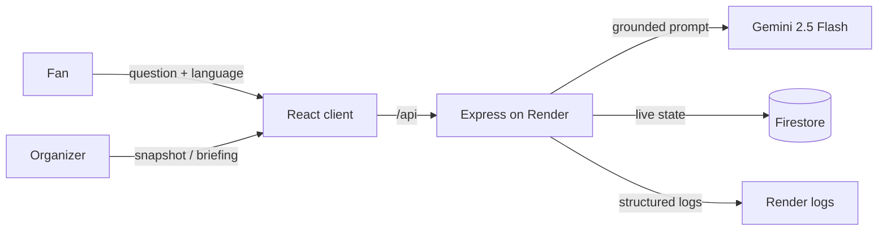

# ArenaFlow

**Fans get answers. Organizers get visibility. One stadium app, two jobs.**

On matchday, a fan needs to find Gate 6 in a language the signage isn't
printed in. Ten seconds later, an organizer needs to know Zone C is getting
dangerously crowded, right now. ArenaFlow is built around that split: a
grounded, multilingual assistant for supporters, and a live operations
dashboard for the people running the venue — sharing one codebase, one
venue dataset, and one deploy.

🔗 **Live:** https://arenaflow-1.onrender.com/

---

## The two surfaces

**`/assistant` — for fans.** A grounded chat that answers wayfinding,
accessibility, transport, and facility questions in English, Spanish,
French, Portuguese, or Arabic. Quick-action chips cover the most common
asks; anything mentioning mobility gets step-free routing prioritized.
Loses connectivity mid-conversation? It falls back to cached venue data
with a visible offline banner instead of failing silently.

**`/operations` — for staff.** A live board of per-zone crowd density,
open incidents, and sustainability metrics (waste diverted, energy, water,
CO₂), auto-refreshing on an interval. One button — "Generate AI
Briefing" — turns the current snapshot into a prioritized list of
recommended actions.

| It handles               | How                                                                              |
| ------------------------ | -------------------------------------------------------------------------------- |
| Wayfinding               | Gate/section/facility routing, step-free paths                                   |
| Crowd management         | Live density status (comfortable / busy / critical) + AI redirection suggestions |
| Accessibility            | Dedicated accessible-route answers + a WCAG 2.1 AA interface app-wide            |
| Transport                | Metro, shuttle, bus, parking, rideshare, incl. accessible options                |
| Sustainability           | Live meters + AI-generated sustainability actions                                |
| Multilingual support     | 5 languages, grounded, not machine-translated after the fact                     |
| Operational intelligence | Live Firestore-backed snapshot of zones/incidents/sustainability                 |
| Real-time decisions      | One-click AI briefing from the current live state                                |
| Offline resilience       | Cached fallback for both the assistant and the ops snapshot                      |

---

## Under the hood

npm-workspaces monorepo. Route handlers stay thin; feature services hold
logic; `lib/` holds pure, reusable pieces. A dependency-cruiser rule
enforces that server features can't reach into each other or into client
code — checked in CI, not just by convention.

```text
arenaflow/
├── server/                    Node 22 · Express 5 · TypeScript
│   └── src/
│       ├── config/            zod-validated env + constants
│       ├── lib/                firestore · gemini · logger · app-error · ttl-cache
│       ├── middleware/        error-handler · validate(zod) · rate-limit
│       └── features/
│           ├── stadium/        venue grounding data + facilities API
│           ├── assistant/      multilingual grounded Q&A (Gemini)
│           └── operations/     live snapshot, telemetry sim, AI briefing
├── client/                    React 19 · TypeScript · Vite
│   └── src/
│       ├── components/         AppLayout · ErrorBoundary · OfflineBanner · StatusMessage
│       ├── lib/                 typed API client · offline cache store
│       └── features/
│           ├── home/            landing page
│           ├── assistant/       page + hook + cached-venue-time helper
│           ├── operations/      page + hook + snapshot-polling helper
│           └── accessibility/   public accessibility statement
├── e2e/                        Playwright specs (incl. offline + live smoke)
├── docs/                       architecture, decisions, Lighthouse + load-test results
├── scripts/preflight.sh        pre-submission self-audit
└── Dockerfile                  multi-stage build → single deployable service
```



### Endpoints

| Method + path                           | Purpose                                 |
| --------------------------------------- | --------------------------------------- |
| `GET /api/health`                       | Liveness + version check                |
| `GET /api/stadium/facilities?category=` | Venue facilities for quick actions      |
| `POST /api/assistant/ask`               | Grounded, multilingual Gemini answer    |
| `GET /api/operations/snapshot`          | Live zones, incidents, sustainability   |
| `POST /api/operations/briefing`         | AI-generated operations briefing        |
| `GET /.well-known/security.txt`         | RFC 9116 coordinated-disclosure contact |

---

## Stack

React 19 · TypeScript 5.8 (strict) · Vite 7 · React Router 7 — Node 22 ·
Express 5 · Zod — `@google/genai` (Gemini 2.5 Flash) ·
`@google-cloud/firestore` — Helmet · Pino — Vitest · Testing Library ·
Playwright · Stryker — deployed on Render.

---

## Running it

```bash
npm install
cp .env.example .env      # add your GEMINI_API_KEY

npm run dev:server        # API on :8080
npm run dev:client        # client on :5173
```

| Script                   | Does what it says                                        |
| ------------------------ | -------------------------------------------------------- |
| `build`                  | Production build, client then server                     |
| `lint` / `lint:deps`     | ESLint (zero warnings) / dependency-boundary check       |
| `typecheck`              | `tsc --noEmit` across both workspaces                    |
| `test` / `test:coverage` | Vitest, with or without coverage thresholds enforced     |
| `test:e2e`               | Playwright against a local build                         |
| `test:e2e:live`          | Read-only Playwright smoke test against the deployed URL |
| `test:mutation`          | Stryker, scoped to pure logic modules                    |

---

## Testing, honestly

`test:coverage` enforces a **95%** floor (lines/functions/branches/
statements) per workspace — CI fails on regression, not just on a broken
build.

- **Server** — 79 tests. Unit coverage for env validation, the TTL cache,
  the Gemini client (success, retry, sanitized-failure paths), grounding
  context, and every feature service, plus zod boundary tests and full
  supertest integration tests across every route — including validation
  rejection and the sanitized 502 path. Firestore is faked in-memory so
  runs stay hermetic.
- **Client** — 51 tests. Testing Library coverage of the full assistant
  flow (typed question, quick action, language passthrough, offline
  fallback), the operations dashboard (live render, accessible density
  meters, snapshot error, briefing generation, offline fallback), routing,
  and the error boundary.
- **E2E (Playwright)** — the assistant and operations flows end-to-end
  against a real build, each closing with an `@axe-core/playwright` WCAG
  2.1 A/AA scan; a dedicated offline-mode spec; and a separate read-only
  suite (`test:e2e:live`) that smoke-tests the actual deployed URL.
- **Mutation testing (Stryker)** — scoped deliberately to four pure,
  deterministic modules (crowd density calc, TTL cache, error model, async
  utilities) rather than the whole tree, with a 90% break threshold. I/O-
  heavy route/service code isn't mutation-tested — it's the wrong tool for
  code whose behavior depends on external state.
- **Load testing (k6)** — a documented run simulating concurrent matchday
  traffic against the assistant and snapshot endpoints; results in
  [docs/load-test-results.md](docs/load-test-results.md).

---

## Security

- Every request boundary is validated with strict zod schemas — unknown
  keys rejected, the assistant's question field length-capped.
- Helmet CSP (one narrowly-scoped `unsafe-inline` grant for style
  attributes only — documented in `server/src/app.ts`, not a blanket
  exemption), an explicit CORS allowlist, a 100 kB JSON body cap, and
  layered rate limits (general traffic + a stricter budget on the
  Gemini-backed endpoints).
- `/.well-known/security.txt` (RFC 9116) for coordinated disclosure.
- One central error handler returns sanitized `{ code, message }` bodies;
  stack traces stay server-side, in logs only.
- CI runs a gitleaks secrets scan, `npm audit --omit=dev --audit-level=high`,
  a Semgrep SAST pass, and generates a CycloneDX SBOM on every push.
- Secrets (`GEMINI_API_KEY`, Firestore credentials) live as environment
  variables in Render's dashboard — nothing sensitive in the repo, image,
  or git history.

---

## Performance

- Route-level code splitting — each persona page loads lazily.
- `compression()` on responses; long-lived caching on hashed assets,
  `no-cache` on the HTML shell.
- Module-scoped Gemini and Firestore clients, reused across requests;
  every Gemini call carries a timeout and one retry.
- In-memory TTL caching absorbs repeated assistant questions and briefings.
- Lighthouse 100 Performance / 100 Best Practices on the live URL — full
  numbers and the reproduction command in
  [docs/lighthouse-results.md](docs/lighthouse-results.md).

---

## Accessibility

WCAG 2.1 AA target, checked with axe and Lighthouse — plus a public
[accessibility statement](client/src/features/accessibility/AccessibilityPage.tsx)
page, not just a README claim.

- Semantic landmarks, a skip link, one `h1` per route.
- Every control is programmatically labeled and keyboard-reachable, with
  visible focus states.
- `aria-live` regions announce assistant answers and briefings; crowd
  density is exposed as an accessible `meter`, not just a colored bar.
- Status is never color-only; contrast holds at 4.5:1;
  `prefers-reduced-motion` is respected.
- `jsx-a11y` lint rules enforced, not just manually checked.
- Lighthouse Accessibility 100 on every route — see
  [docs/lighthouse-results.md](docs/lighthouse-results.md).

---

## Repo hygiene

Husky + commitlint enforce conventional commit messages and run
lint/typecheck before every commit. `.github/` carries issue and PR
templates, CODEOWNERS, and a weekly Dependabot config. Decisions worth
remembering later live in [docs/decisions.md](docs/decisions.md); the
overall shape of the system is in
[docs/ARCHITECTURE.md](docs/ARCHITECTURE.md).

---

## Deployment & external services

| Service                  | Role here                                                 | Where                         |
| ------------------------ | --------------------------------------------------------- | ----------------------------- |
| Render                   | Hosts the single containerized service (API + client)     | `Dockerfile`                  |
| Gemini (`@google/genai`) | Grounded multilingual answers + operations briefings      | `server/src/lib/gemini.ts`    |
| Firestore                | Live operational state — zones, incidents, sustainability | `server/src/lib/firestore.ts` |
| Render environment vars  | Holds `GEMINI_API_KEY` and Firestore credentials          | Render dashboard              |
