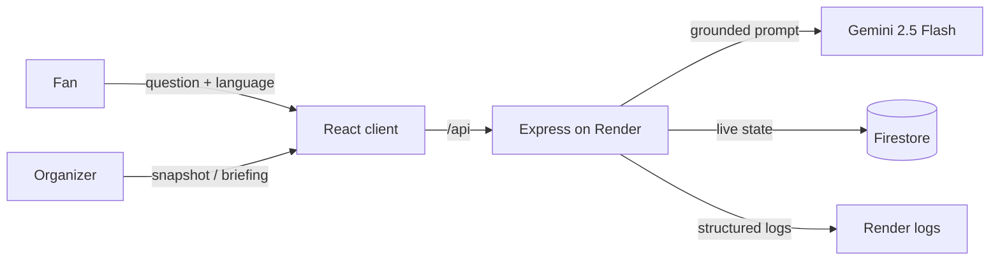

# ArenaFlow

**A GenAI operations layer for large-venue matchdays.**

ArenaFlow is built around a simple split: fans need answers, organizers need
visibility. One platform serves both — a grounded multilingual assistant for
supporters navigating a stadium, and a live operations dashboard for the
people running it.

🔗 **Live app:** https://virtual-prompt-war-4.onrender.com/

---

## Why it's built this way

Two very different users show up to the same stadium on matchday:

- A **fan** who doesn't know where Gate 6 is, whether there's a step-free
  route to it, or which shuttle gets them home — and may be asking in a
  language the signage isn't printed in.
- An **organizer** who needs to know, right now, whether Zone C is getting
  dangerously crowded and what to do about it.

ArenaFlow answers both from one codebase: `/assistant` for fans,
`/operations` for staff, sharing the same venue data underneath.

---

## What it covers

| Theme                        | What ArenaFlow actually does                                                                       | Where         |
| ---------------------------- | -------------------------------------------------------------------------------------------------- | ------------- |
| Wayfinding                   | Grounded gate/section/facility routing, including step-free paths                                  | `/assistant`  |
| Crowd density                | Live per-zone status (comfortable / busy / critical) with AI-suggested redirections                | `/operations` |
| Accessibility                | Accessible-route answers (elevators, sensory room, accessible gates) + WCAG 2.1 AA UI              | app-wide      |
| Getting there / getting home | Metro, shuttle, bus, parking, rideshare — including accessible options                             | `/assistant`  |
| Sustainability               | Live meters (waste diverted, energy, water refills, CO₂ saved) + AI sustainability recommendations | `/operations` |
| Multilingual support         | English, Spanish, French, Portuguese, Arabic                                                       | `/assistant`  |
| Live operational picture     | Auto-refreshing snapshot of zones, incidents, and sustainability metrics from Firestore            | `/operations` |
| Real-time decisions          | One-click AI briefing that turns the current snapshot into prioritized actions                     | `/operations` |

Every row above is a working flow on the live URL, not a slide.

---

## How it's put together

An npm-workspaces monorepo, split cleanly along the fan/organizer line:

```text
arenaflow/
├── server/                 Node 22 · Express 5 · TypeScript
│   └── src/
│       ├── config/         zod-validated env + constants
│       ├── lib/            firestore · gemini · logger · app-error · ttl-cache
│       ├── middleware/     error-handler · validate(zod) · rate-limit
│       └── features/
│           ├── stadium/    venue grounding data + facilities API
│           ├── assistant/  multilingual grounded Q&A (Gemini)
│           └── operations/ live snapshot, telemetry sim, AI briefing
├── client/                 React 19 · TypeScript · Vite
│   └── src/
│       ├── components/     AppLayout · ErrorBoundary · StatusMessage
│       ├── lib/             typed API client
│       └── features/
│           ├── home/        landing page
│           ├── assistant/   AssistantPage + hook + sub-components
│           └── operations/  OperationsPage + hook + sub-components
├── docs/decisions.md        why things are built the way they are
├── scripts/preflight.sh     pre-submission self-audit
└── Dockerfile                multi-stage build → single deployable service
```

Route handlers stay thin and dispatch to feature services; `lib/` holds pure,
reusable pieces so the business logic isn't tangled up with Express or
Firestore specifics.



### Endpoints

| Method + path                           | What it's for                         |
| --------------------------------------- | ------------------------------------- |
| `GET /api/health`                       | Liveness + version check              |
| `GET /api/stadium/facilities?category=` | Venue facilities for quick actions    |
| `POST /api/assistant/ask`               | Grounded, multilingual Gemini answer  |
| `GET /api/operations/snapshot`          | Live zones, incidents, sustainability |
| `POST /api/operations/briefing`         | AI-generated operations briefing      |

---

## Stack

React 19 · TypeScript 5.8 (strict) · Vite 7 · React Router 7 — Node 22 ·
Express 5 · Zod — `@google/genai` (Gemini 2.5 Flash) ·
`@google-cloud/firestore` — Helmet · Pino — Vitest · Testing Library —
deployed on Render.

---

## Running it locally

```bash
npm install
cp .env.example .env      # add your GEMINI_API_KEY

npm run dev:server        # API on :8080
npm run dev:client        # client on :5173
```

Useful root scripts: `build`, `lint`, `typecheck`, `test`, `test:coverage`,
`format`.

---

## Testing

`npm run test:coverage` enforces coverage thresholds per workspace (90%
lines/functions/branches/statements) — CI fails on regression.

**Server** — 54 tests, 97% line coverage. Covers env validation, the TTL
cache, the Gemini client (success path, retry, sanitized failure), grounding
context, and every feature service; zod boundary tests; and supertest
integration tests across every route including validation rejection and the
sanitized 502 path. Firestore is faked in-memory so runs stay hermetic.

**Client** — 24 tests, 98% line coverage. Testing Library coverage of the
full assistant flow (typed question, quick action, language passthrough,
error state), the operations dashboard (live render, accessible density
meters, snapshot error, briefing generation), routing, and the error
boundary.

---

## Security posture

Full threat model in [SECURITY.md](SECURITY.md).

- Secrets (`GEMINI_API_KEY`, Firestore credentials) are set as environment
  variables in Render's dashboard — nothing sensitive in the repo, image, or
  git history; gitleaks runs in CI.
- Every boundary is validated with strict zod schemas — unknown keys
  rejected, the assistant's question field length-capped.
- HTTP hardening via Helmet (restrictive CSP), an explicit CORS allowlist,
  a 100 kB JSON body cap, and layered rate limits (general traffic + a
  stricter budget on the Gemini-backed endpoints).
- One central error handler returns sanitized `{ code, message }` bodies;
  stack traces stay server-side in logs only.
- `npm audit --omit=dev --audit-level=high` runs on every push, currently
  clean; lockfile is committed.

---

## Performance

- Each persona route is lazily loaded — first paint ships roughly 78 kB
  gzip of JS.
- Response `compression()`, long-lived caching on hashed assets, `no-cache`
  on the HTML shell.
- Gemini and Firestore clients are module-scoped and reused; every Gemini
  call carries a timeout and a single retry.
- In-memory TTL caching absorbs repeated assistant questions and briefings.
- Lighthouse: 100 Performance, 100 Best Practices on the live URL
  (Lighthouse 12.8.2 — see [docs/lighthouse-results.md](docs/lighthouse-results.md)
  for the reproduction command). Live timings: snapshot ~0.4s, assistant
  ~1.8s, cached briefing ~0.3s.

---

## Accessibility

Targets WCAG 2.1 AA, checked with axe and Lighthouse.

- Semantic landmarks, a skip link, one `h1` per route.
- Every control is programmatically labeled and reachable by keyboard, with
  visible focus states.
- `aria-live` regions announce assistant answers and briefings; crowd
  density is exposed as an accessible `meter`, not just a colored bar.
- Status is never color-only — text tags accompany every status color, and
  contrast holds at 4.5:1. `prefers-reduced-motion` is respected.
- `jsx-a11y` lint rules are enforced.
- Lighthouse Accessibility: 100 on every route, zero violations — see
  [docs/lighthouse-results.md](docs/lighthouse-results.md).

---

## Deployment & external services

| Service                  | What it's doing here                                      | Where                         |
| ------------------------ | --------------------------------------------------------- | ----------------------------- |
| Render                   | Hosts the single containerized service (API + client)     | `Dockerfile`                  |
| Gemini (`@google/genai`) | Grounded multilingual answers + operations briefings      | `server/src/lib/gemini.ts`    |
| Firestore                | Live operational state — zones, incidents, sustainability | `server/src/lib/firestore.ts` |
| Render environment vars  | Holds `GEMINI_API_KEY` and Firestore credentials          | Render dashboard              |
