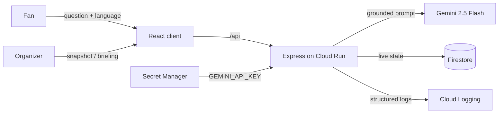

# ArenaFlow — Smart Stadiums & Tournament Operations

GenAI platform for the **FIFA World Cup 2026** that enhances both the fan
experience and venue operations at Estadio Azteca. Fans get multilingual,
grounded navigation, accessibility and transport help; organizers get live
crowd intelligence and AI-generated operational briefings for real-time
decisions.

**Live demo:** <https://stadiumiq-851755555005.asia-south1.run.app>
**Repository:** <https://github.com/Auenchanters/Virtual-Prompt-war-Week-4>
**Region:** asia-south1 · **GCP project:** week-4-501612

---

## Problem Statement Alignment

> Build a GenAI-enabled solution that enhances stadium operations and the
> overall tournament experience for fans, organizers, volunteers, or venue
> staff during the FIFA World Cup 2026 — navigation, crowd management,
> accessibility, transportation, sustainability, multilingual assistance,
> operational intelligence, or real-time decision support.

Every requirement below is a working, demonstrable flow on the live URL.
Nothing ships that is not a row in this table.

| #   | Requirement (problem-statement theme) | How ArenaFlow delivers it                                                                                          | Live route               |
| --- | ------------------------------------- | ------------------------------------------------------------------------------------------------------------------ | ------------------------ |
| R1  | **Navigation**                        | Assistant gives grounded wayfinding — which gate serves a section, step-free routes to any facility                | `/assistant`             |
| R2  | **Crowd management**                  | Operations board shows per-zone density with comfortable/busy/critical status; AI briefing recommends redirections | `/operations`            |
| R3  | **Accessibility**                     | Accessible-route answers (Gate 6, elevators, sensory room) plus a WCAG 2.1 AA interface throughout                 | `/assistant` + whole app |
| R4  | **Transportation**                    | Assistant answers on metro, fan shuttle, bus, parking and rideshare, including accessible options                  | `/assistant`             |
| R5  | **Sustainability**                    | Live sustainability meters (waste diverted, energy, water refills, CO₂ saved) and AI sustainability actions        | `/operations`            |
| R6  | **Multilingual assistance**           | Assistant answers in English, Spanish, French, Portuguese and Arabic                                               | `/assistant`             |
| R7  | **Operational intelligence**          | Live operational snapshot (zones, incidents, sustainability) from Firestore, auto-refreshing                       | `/operations`            |
| R8  | **Real-time decision support**        | "Generate AI Briefing" turns the current live snapshot into prioritized crowd, incident and sustainability actions | `/operations`            |

---

## Features

- **Matchday Fan Assistant** (`/assistant`) — a multilingual chat grounded on
  the official venue dataset. Quick-action chips for the most common
  questions, a language selector, and answers that prioritize step-free and
  accessible options when mobility is mentioned.
- **Operations Command Center** (`/operations`) — a live board of zone crowd
  density, open incidents and sustainability metrics, refreshed on an
  interval, with an on-demand **AI Operations Briefing** that reads the
  current snapshot and returns prioritized recommendations.

---

## Architecture

Feature-folder monorepo (npm workspaces). Route handlers dispatch; feature
services hold logic; `lib/` holds pure, reusable utilities.

```text
arenaflow/
├── server/                       Node 22 · Express 5 · TypeScript
│   └── src/
│       ├── config/               env (zod-validated) + constants
│       ├── lib/                  firestore · gemini · logger · app-error · ttl-cache
│       ├── middleware/           error-handler · validate(zod) · rate-limit
│       └── features/
│           ├── stadium/          venue grounding data + facilities API
│           ├── assistant/        multilingual grounded Q&A (Gemini)
│           └── operations/       live snapshot, telemetry sim, AI briefing
├── client/                       React 19 · TypeScript · Vite
│   └── src/
│       ├── components/           AppLayout · ErrorBoundary · StatusMessage
│       ├── lib/                  typed API client
│       └── features/
│           ├── home/             landing page
│           ├── assistant/        AssistantPage + hook + sub-components
│           └── operations/       OperationsPage + hook + sub-components
├── docs/decisions.md             architecture decision records
├── scripts/preflight.sh          pre-submission audit
└── Dockerfile                    multi-stage build → single Cloud Run service
```



### API

| Method + path                           | Purpose                                |
| --------------------------------------- | -------------------------------------- |
| `GET /api/health`                       | Liveness + version                     |
| `GET /api/stadium/facilities?category=` | Venue facilities for quick actions     |
| `POST /api/assistant/ask`               | Grounded, multilingual answer (Gemini) |
| `GET /api/operations/snapshot`          | Live zones, incidents, sustainability  |
| `POST /api/operations/briefing`         | AI operations briefing (Gemini)        |

---

## Tech Stack

React 19 · TypeScript 5.8 (strict) · Vite 7 · React Router 7 · Node 22 ·
Express 5 · Zod · `@google/genai` (Gemini 2.5 Flash) ·
`@google-cloud/firestore` · Helmet · Pino · Vitest · Testing Library ·
Cloud Run · Secret Manager · Firestore · Cloud Logging.

---

## Getting Started

```bash
# 1. Install (npm workspaces)
npm install

# 2. Configure environment
cp .env.example .env      # add your GEMINI_API_KEY

# 3. Run API (:8080) and client (:5173) in two terminals
npm run dev:server
npm run dev:client
```

Root scripts: `build` · `lint` · `typecheck` · `test` · `test:coverage` ·
`format`.

---

## Testing

Run `npm run test:coverage`. Coverage thresholds (90% lines, functions,
branches, statements) are enforced in each workspace's Vitest config, so CI
fails if coverage regresses.

- **Server — 54 tests, 97% line coverage.** Unit tests for env validation,
  the TTL cache, the Gemini client (success, retry, sanitized failure),
  grounding context, and all feature services; zod schema boundary tests; and
  full supertest integration tests covering every route, validation rejection
  and the sanitized 502 path. Firestore is faked in-memory for hermetic runs.
- **Client — 24 tests, 98% line coverage.** Testing Library tests for the
  full assistant flow (typed question, quick action, language passthrough,
  error state), the operations dashboard (live render, accessible density
  meters, snapshot error, briefing generation), routing, and the error
  boundary.

---

## Security

See [SECURITY.md](SECURITY.md) for the full threat model.

- **Secrets** in Google Secret Manager, mounted via `--set-secrets`; nothing
  sensitive in the repo, image or git history. CI runs a gitleaks scan.
- **Input validation** with strict zod schemas at every boundary; unknown
  keys rejected, assistant question length-capped.
- **HTTP hardening**: Helmet with a restrictive CSP, an explicit CORS origin
  allowlist, a 100 kB JSON body limit, and layered rate limits (general +
  stricter on the Gemini endpoints).
- **Error hygiene**: one central handler returns sanitized `{ code, message }`
  bodies; stack traces and internal detail are logged server-side only.
- **Supply chain**: `npm audit --omit=dev --audit-level=high` → 0
  vulnerabilities, enforced as a CI step on every push; lockfile committed.

---

## Performance

- Route-level code splitting: each persona page is lazily loaded, so the
  initial route ships ~78 kB gzip of JavaScript.
- `compression()` on responses; long-lived `Cache-Control` on content-hashed
  assets, `no-cache` on the HTML shell.
- Module-scope Gemini and Firestore clients reused across requests; every
  Gemini call has a timeout and one retry.
- In-memory TTL caches for repeated assistant questions and briefings.
- `--min-instances=1` keeps a warm instance for a sub-2s first response.
- **Lighthouse Performance 100 / Best Practices 100** on the live URL
  (Lighthouse 12.8.2; scores and reproduction command in
  [docs/lighthouse-results.md](docs/lighthouse-results.md)). Live API timings:
  snapshot ~0.4 s, assistant ~1.8 s, cached briefing ~0.3 s.

---

## Accessibility

Built to **WCAG 2.1 AA** and verified with axe and Lighthouse.

- Semantic landmarks (`header`, `nav`, `main`), a skip link, and one `h1` per
  route.
- Every control has a programmatic label; the app is fully keyboard operable
  with visible focus rings.
- Live regions (`aria-live`) announce assistant answers and briefings;
  density is exposed as an accessible `meter` with a descriptive label.
- Status is never colour-only (text tags accompany every colour); contrast
  meets 4.5:1 for text; `prefers-reduced-motion` is honoured.
- `jsx-a11y` rules enforced in lint.
- **Lighthouse Accessibility 100** on every route (home, `/assistant`,
  `/operations`) with zero audit failures — see
  [docs/lighthouse-results.md](docs/lighthouse-results.md). Lighthouse's
  accessibility audits run the axe-core ruleset; status colours were tuned to
  meet the 4.5:1 contrast bar.

---

## Google Cloud Integration

Each service is load-bearing, accessed through its official SDK.

| Service                      | Role in ArenaFlow                                                                              | Where                                                |
| ---------------------------- | ---------------------------------------------------------------------------------------------- | ---------------------------------------------------- |
| **Cloud Run**                | Hosts the single containerized service (API + client), `--min-instances=1`, region asia-south1 | `Dockerfile`, deploy                                 |
| **Gemini (`@google/genai`)** | Generates grounded multilingual answers and operations briefings                               | `server/src/lib/gemini.ts`                           |
| **Firestore**                | Stores live operational state — zones, incidents, sustainability                               | `server/src/lib/firestore.ts`, `features/operations` |
| **Secret Manager**           | Holds `GEMINI_API_KEY`, mounted via `--set-secrets`                                            | deploy config                                        |
| **Cloud Logging**            | Receives structured JSON logs (severity-tagged) from stdout                                    | `server/src/lib/logger.ts`                           |

---

## Team

Built by Utkarsh Singh Yadav for Hack2skill PromptWars Virtual — Week 4.

Licensed under the [MIT License](LICENSE).
